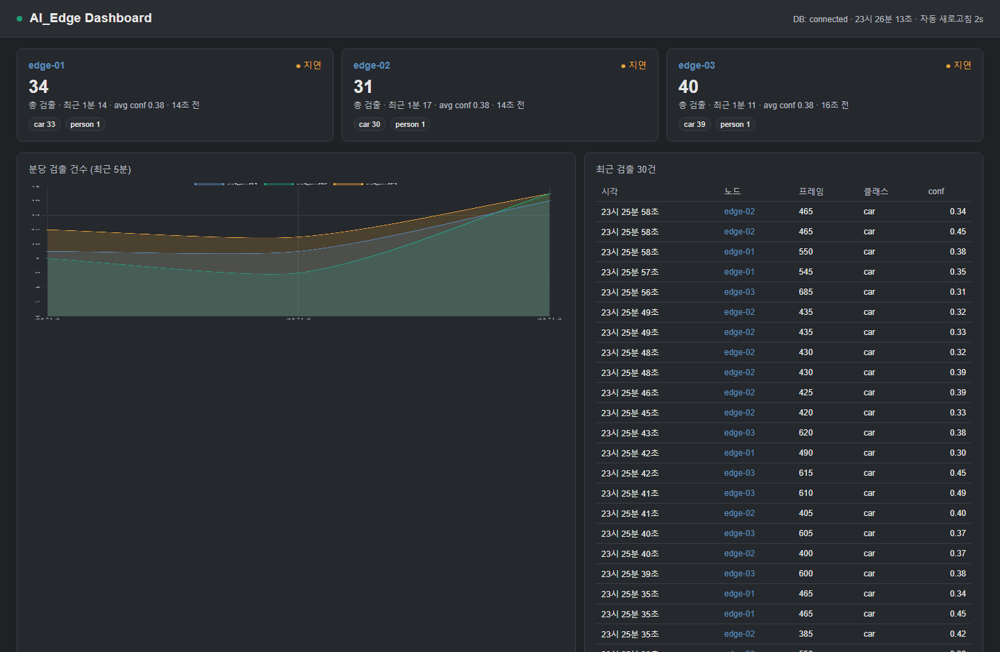

# AI_Edge — 다중 엣지 노드 영상 추론 + 중앙 집계

드론·블랙박스 등 **저사양 엣지 디바이스 여러 대**가 영상을 YOLOv8n 으로 추론하고,
confidence 필터를 거쳐 **중앙 PostgreSQL 로 모으는** 분산 추론 시스템을 Docker Compose 로 시뮬레이션한다.

> 핵심은 모델 정확도가 아니라 **동일 이미지 × 다중 노드 × 리소스 제약 × 중앙 집계**라는 배포 구조다.



## 아키텍처 (5개 컨테이너)

```
 edge-01 ┐
 edge-02 ┼─ YOLOv8n 추론 → INSERT ─▶  db (PostgreSQL)  ◀─ 폴링 ─ monitor (콘솔 집계)
 edge-03 ┘                                  ▲
                                            └── 폴링 ─ dashboard (FastAPI + Chart.js, :8080)
```

| 컨테이너 | 역할 |
|---|---|
| `db` | PostgreSQL 16. `detections` 테이블에 모든 검출을 저장 (`db/init.sql` 스키마) |
| `edge-01/02/03` | 동일한 `ai-edge/infer` 이미지. `DEVICE_ID`·`VIDEO_FILE` 환경변수만 다르게 주입 |
| `monitor` | 1초마다 DB를 폴링해 노드별 집계를 콘솔에 출력 (데이터 흐름 검증용) |
| `dashboard` | FastAPI 백엔드 + 단일 페이지 대시보드. 2초마다 갱신, http://localhost:8080 |

**데이터 흐름:** 각 엣지 노드가 영상을 `FRAME_STRIDE` 간격으로 추론 → `confidence ≥ CONF_TH` 객체만
`db` 의 `detections` 테이블에 INSERT → `monitor` 와 `dashboard` 가 같은 테이블을 폴링해 실시간 표시.

## 실행

```bash
cd app
bash scripts/fetch_model.sh          # 모델 가중치
bash scripts/fetch_sample_video.sh   # 데모 영상 (~20MB, 용량상 미커밋)
docker compose up --build            # → http://localhost:8080
```

성공 시: 5개 컨테이너가 기동하고, 브라우저에서 **http://localhost:8080** 에 접속하면
edge-01/02/03 카드가 "● 활성" 으로 검출 수가 올라가고, 분당 추이 차트와 최근 검출 테이블이
2초마다 갱신된다. `monitor` 로그에서도 1초마다 노드별 INSERT 건수를 확인할 수 있다.

### DB 비밀번호 설정 (선택)

기본값은 `edge` 로 설정 없이 바로 동작한다. 운영 환경에서는 `.env` 로 덮어쓴다:

```bash
cp .env.example .env
# .env 에서 DB_PASSWORD=원하는값 으로 수정
```

`docker-compose.yml` 은 `${DB_PASSWORD:-edge}` 형태로 참조하므로 `.env` 가 없으면 기본값을 사용한다.
노드별로 다른 영상을 주입하려면 `.env` 의 `VIDEO_01/02/03` 도 함께 지정한다.

## 트러블슈팅

| 증상 | 점검 |
|---|---|
| 엣지 컨테이너가 바로 종료 | `docker compose logs edge-01` — 영상/모델 경로 오류, DB 연결 실패 여부 확인 |
| 대시보드가 비어 있음 | `monitor` 로그에 INSERT 가 찍히는지 확인. 안 찍히면 엣지 측, 찍히는데 화면만 비면 `dashboard` 측 |
| `sample.mp4 not found` | `bash scripts/fetch_sample_video.sh` 로 `videos/` 에 영상을 먼저 받았는지 확인 |
| DB 연결 거부 | `db` 헬스체크가 통과할 때까지 엣지/모니터가 자동 재시도한다(최대 60초) |

## 프로젝트 구조

```
AI_Edge/
├── app/                      실행 가능한 전체 구성 (Docker Compose)
│   ├── edge_infer/           YOLOv8n 추론 워커 (infer.py + Dockerfile)
│   ├── monitor/              DB 1초 폴링 모니터
│   ├── dashboard/            FastAPI + Chart.js 실시간 대시보드
│   ├── db/init.sql           detections 테이블 스키마
│   ├── models/yolov8n.pt     모델 가중치 (별도 볼륨)
│   ├── videos/               영상 데이터 (별도 볼륨)
│   ├── scripts/              모델·샘플영상 다운로드 스크립트
│   ├── docker-compose.yml    db · edge-01/02/03 · monitor · dashboard
│   └── .env.example
├── docs/
│   ├── diagrams/             아키텍처 다이어그램 이미지
│   └── screenshots/          aiedge_live.png (실제 구동 캡처)
└── LICENSE
```

## 설계 포인트

| 항목 | 구현 |
|---|---|
| **동일 이미지 × 다중 배포** | edge-01/02/03 이 같은 `ai-edge/infer` 이미지, `DEVICE_ID`·`VIDEO_FILE` 만 다름 |
| **엣지 리소스 모사** | 컨테이너당 `cpus: 0.5`, `mem_limit: 512m` |
| **저장량 폭주 방지** | `confidence ≥ CONF_TH` 만 INSERT, `FRAME_STRIDE` 로 프레임 샘플링 |
| **독립 교체** | 모델·영상을 별도 볼륨으로 분리 (`./models`, `./videos`) |
| **데이터 흐름 검증** | monitor 1초 폴링 + FastAPI 대시보드 |

노드를 늘리려면 `docker-compose.yml` 에 `edge-04`, `edge-05` … 블록을 같은 패턴으로 복제한다.

## 실제 구동 검증 (2026-06-12) — mock 아님

Docker 로 실제 기동해 3개 노드가 추론 → 중앙 DB 적재 → 대시보드 실시간 표시까지 확인했다.
구동 중 발견한 버그 2개(대시보드 타임존 오표시, LOOP 미작동)를 수정했다.
증빙: [`docs/screenshots/aiedge_live.png`](docs/screenshots/aiedge_live.png).

## 다음 단계

- 입력을 파일 비디오 → RTSP/USB 카메라 스트림으로 교체
- INT8 양자화 후 NPU(Hailo-8 등) 배포 트랙
- 노드 메트릭(FPS·latency)을 Prometheus + Grafana 로 시각화

## 기술 스택

YOLOv8n · Docker Compose · PostgreSQL · FastAPI · Chart.js

## 라이선스

MIT — [LICENSE](LICENSE) 참조.
